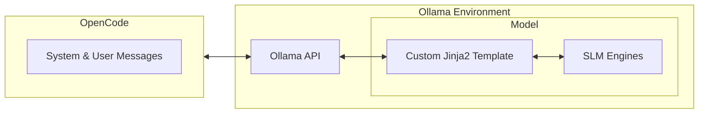

# ollama SLM Lab for OpenCode

A specialized test bed for optimizing Small Language Models (SLMs) on [Ollama](https://ollama.com/) for [OpenCode](https://opencode.ai/). This project provides a build environment to harden models like Granite and Qwen against the specific constraints of the Ollama API and OpenCode's agentic requirements.

## Quick Start

**Prerequisites:** Install [GNU Make](https://www.gnu.org/software/make/) and [Ollama](https://ollama.com/).

- **Windows:** Install via [Scoop](https://scoop.sh/):

```powershell
scoop install make ollama

```

- **Linux/macOS:** Use your standard package manager (e.g., `apt install make` or `brew install make`).

### Build Models

```bash
# Ensure Ollama is running
ollama serve &

# Build optimized Granite variants
cd granite3.3/ollama
make ollama.recreate

# Build optimized Qwen variants
cd ../../qwen2.5-coder/ollama
make ollama.recreate

```

## The Problem

Standard SLMs often fail in OpenCode environments due to:

- **System Message Bloat:** Large system prompts exceeding standard SLM context windows.
- **Tool-Call Fragility:** Inconsistent formatting between Ollama templates and model expectations.
- **Tag Stripping:** The Ollama API failing to parse non-JSON tags (e.g., `<tool_call>`), breaking the agent loop.



This lab bridges the gap by injecting custom **Modelfiles** and **Jinja2 templates** into the Ollama environment.

## Model Specifications

| Feature             | Granite 3.3         | Qwen 2.5-Coder                |
| ------------------- | ------------------- | ----------------------------- |
| **Base Model**      | `granite3.3:latest` | `qwen2.5-coder:latest`        |
| **Temperature**     | 0 (Deterministic)   | 0 (Deterministic)             |
| **Default Context** | 32,768              | 12,288                        |
| **Stop Tokens**     | `<tool_call>`       | `<tool_call>`, `</tool_call>` |

## Build System

We automate model creation across two variants: **Fast** (16k context) and **Agent** (64k context).

> [!NOTE]
> **Automatic Modelfile Generation:** If a base `.Modelfile` is missing, the script automatically generates it using `ollama show --modelfile`.

### Makefile Commands

| Command                   | Action                                  |
| ------------------------- | --------------------------------------- |
| `make ollama.create`      | Build all variants (Base, Fast, Agent). |
| `make ollama.recreate`    | Full clean and rebuild.                 |
| `make ollama.clean`       | Remove temporary build files.           |
| `make ollama.mostlyclean` | Uninstall models from Ollama.           |

## Adding Support for New Models

1. **Create directory:** `mkdir -p <model-name>/ollama`
1. **Create `Makefile`:** Simply include the shared config:

    ```makefile
    -include ../../include/ollama.mk

    ```

1. **Build models:** `make ollama.recreate`

### Pro-Tip

The **Agent** version uses a 64k context window. Ensure your hardware has sufficient VRAM to handle the KV cache; otherwise, use the **Fast** version (16k).
